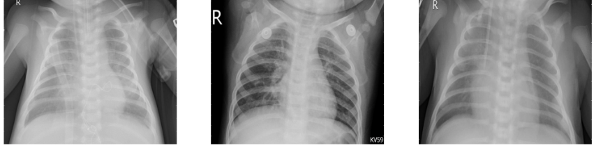

# Pneumonia Detection In Pediatric Chest X-rays
**Author: Jaclyn Dwyer**


## Overview
The goal of this project is to help doctors with diagnoses by creating a model that can detect if a x-ray looks normal or if there is pneumonia present. 
This will hopefully lead to more accurate diagnoses as well as help in getting the vast amount of x-rays read. Two types of models will be created including 
Multi Layer Perceptron (MLP) models as well as Convolutional Neural Network (CNN) models. These models will be evalued using recall scores to stress the 
importance of minimizing false negatives.

## Methods
The methodology for this project includes data cleaning, exploratory data analysis, feature engineering, and running various models to determine the model 
with the highest recall score.

## Data
The data consisted of a total of 5,856 images from Kaggle. For this project, the validation and test set are switched due to the small size of the original validation 
set. The images are processed using Keras' image processing tools.

## Exploratory Data Analysis
To become familiar with the data, some images in the normal train set as well as the pneumonia train set are visualized to see what the images look like. 
Additionally, a graph is created to explore the class imbalance contained in the data.

### X-ray Visualization
In gerenal, pneumonia will reveal areas of opacity in the chest x-rays. X-rays are visualized to see what the normal x-rays look like compared to the 
pneumonia x-rays and to see if there looks to be a difference in opacity between the two categories. Looking at the images, the pneumonia x-rays do seem to 
look cloudier.

**Normal**


**Pneumonia**



### Class Imbalance
Plotting the counts for normal x-rays and pneumonia x-rays shows a class imbalance between the two categories with more pneumonia x-rays. To account for this, 
a class weight is created to use when modeling.


## Models
Models are created to try and find a model with the best recall score. The MLP models are created first, followed by the CNN models. There was a high amount of
overfitting in most models so regularization techniques including l1 regularization, early stopping, and dropout are implemented to try and minimize overfitting. 
The best model was the third MLP model which included all three regularization techniques.

## Final Model
The final model included an l1 of 0.0005, activation of 'relu' and 'sigmoid', dropout of 0.1, and early stopping. With this model the recall on the train set 
is 0.9918, recall on the validation set is 0.8034, and recall on the test set is 1. 


The confusion matrix shows that the model does have more false positives. However, because the focus was to create a model which minimizes false negatives, this model is still deemed the best model for determining if a 
chest x-ray is normal or if the chest x-ray shows pneumonia.

## Next Steps: 
Some furture steps to improve the model include:
  - Running more models to try and improve Recall score
  - Trying other techniques to minimize overfitting, such as batch normalization
  - Implementing transfer learning models

## Repository Structure
```
├── best_models
├── data/chest_xrays/chest_xrays
├── images
├── notebooks
├── Final_Notebook.ipynb
├── Presentation.pdf
└── README.md
```
